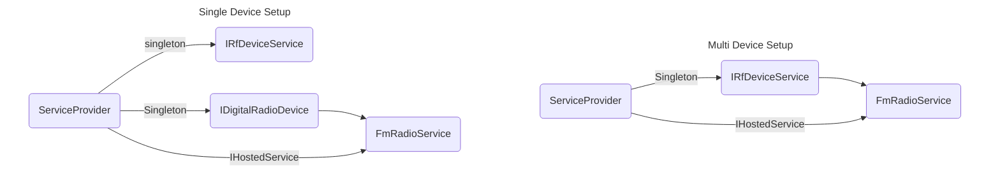

# HackRfDotnet Using Dependency Injection
HackRfDotnet is highly DI-friendly and provides extension methods for HostBuilder to configure single or multiple device access.
Below is a basic example using an analogue FM radio as an IHostedService to stream from a device stream singleton.

---

### Configure the HostBuilder
Configure the HostBuilder as shown in the example using UseFirstRadioDevice.
UseFirstRadioDevice is an extension method from HackRfDotnet that sets up single-device access. It adds an RfDevice singleton to the DI host. Adding this RfDevice also creates an IQ stream and opens the device RX, starting the flow of IQ samples into the ring buffer.
```cs
internal class Program {
    static async Task Main(string[] args) {
        // Create a new host builder.
        var appHost = new HostBuilder();
        appHost
            // Use HackRfDotnet's extension method to configure single device access.
            .UseFirstRadioDevice(SampleRate.FromMsps(20))
            .ConfigureServices(ConfigureServices);

        // Run the DI Host
        await appHost.RunConsoleAsync();
    }

    static void ConfigureServices(IServiceCollection serviceCollection) {
        // Configure additional services, FMRadioService in this case.
        serviceCollection
            .AddHostedService<FmRadioService>();
    }
}
```

### Radio Service (Consumer)
This is our FmRadioService, this is our IHostedService that actually starts the buffer feeding into NAudio.
```cs
internal class FmRadioService : IHostedService, IDisposable {
    private readonly IDigitalRadioDevice _radioDevice;
    private readonly FmSignalStream _signalStream;

    // We get IDigitalRadioDevice from the DI, as was prepared earlier for us by our "UseFirstRadioDevice".
    public FmRadioService(IDigitalRadioDevice radioDevice) {
        _radioDevice = radioDevice;

        if (_radioDevice.DeviceStream is null) {
            throw new Exception("Radio device stream cannot be null!");
        }

        // Create a new FmSignalStream, this pre-configures a DSP chain for DM demodulation.
        _signalStream = new FmSignalStream(_radioDevice.DeviceStream, Bandwidth.FromKHz(200));
    }

    public void Dispose() {
        _signalStream.Dispose();
    }

    public Task StartAsync(CancellationToken cancellationToken) {
        _radioDevice.SetFrequency(Frequency.FromMHz(98.7f), Bandwidth.FromKHz(120));

        // Create an AnaloguePlayer and begin playing with NAudio.
        var fmPlayer = new AnaloguePlayer(_signalStream);
        fmPlayer.PlayStreamAsync(_radioDevice.Frequency, _radioDevice.Bandwidth, SampleRate.FromKsps(48));

        return Task.CompletedTask;
    }

    public Task StopAsync(CancellationToken cancellationToken) {
        throw new NotImplementedException();
    }
}
```


# DI and Single Device Access
When you configure your HostBuilder with the `UseFirstRadioDevice` extension method, your DI container is populated with a fully initialized and connected RfDevice singleton. During the instantiation of the RfDevice, an IQ stream is automatically created, and streaming begins immediately. While the device resides in the DI container, it continuously maintains a ring buffer in the background, ensuring that IQ samples are always available for consumption by your hosted services.

### Multi Device Access
For scenarios involving multiple devices, you can use the `UseRfDeviceController` extension. This sets up a DeviceController service in your DI container, allowing your application to manage and interact with multiple connected devices. The DeviceController tracks all device instances, enabling you to reconnect to the same device across different hosted services, coordinate parallel streaming, and manage device lifecycles consistently.

---

## DI Runtime
The following graph illustrates the different DI states when using Multi-Device vs Single-Device HostBuilder configurations.
