# Getting Started With HackRf Dotnet
The most basic way we can use HackRfDotnet is by playing an analogue audio stream.  
Amplitude modulation - The phase of the audio signal is encoded in the changes of the amplitude on the carrier rf wave.  
Frequency modulation - The phase of the audio signal is encoded in the changes of the phase on the carrier rf wave.

```cs
Console.WriteLine("Looking for HackRf Device...");
var deviceList = _rfDeviceControllerService.FindDevices();

Console.WriteLine($"Found {deviceList.devicecount} HackRf devices... Opening Rx");
using var rfDevice = _rfDeviceControllerService.ConnectToFirstDevice();

if (rfDevice is null) {
    Console.WriteLine("Could not connect to Rf Device");
    return;
}

// Create an immutable read stream from an RF Device.
using var deviceStream = new IQDeviceStream(rfDevice);

// Open the receive channel on the SDR
deviceStream.OpenRx(SampleRate.FromMsps(20));
```

### To play an FM stream you would use the following block of code.
```cs
// Tune the SDR to the target frequency and bandwidth
rfDevice.SetFrequency(Frequency.FromMHz(98.7f), Bandwidth.FromKHz(200));

// Create a SignalStream configured for FM decoding
var fmSignalStream = new FmSignalStream(deviceStream, Bandwidth.FromKHz(200), stereo: true);

// Create an AnaloguePlayer to play the FM audio stream
var fmPlayer = new AnaloguePlayer(fmSignalStream);
fmPlayer.PlayStreamAsync(rfDevice.Frequency, rfDevice.Bandwidth, SampleRate.FromKsps(48));
```

### To play an AM stream you would use the following block of code.
```cs
// Tune the SDR to the target frequency and bandwidth
rfDevice.SetFrequency(Frequency.FromMHz(118.4f), Bandwidth.FromKHz(10));

// Create a SignalStream configured for AM decoding
var amSignalStream = new AmSignalStream(deviceStream, Bandwidth.FromKHz(10));

// Create an AnaloguePlayer to play the AM audio stream
var amPlayer = new AnaloguePlayer(amSignalStream);
amPlayer.PlayStreamAsync(rfDevice.Frequency, rfDevice.Bandwidth, SampleRate.FromKsps(48));
```

FmSignalStream and AmSignalStream are encapsulations of preconfigured SignalProcessingPipelines. These pipelines downsample, filter, and demodulate the tuned frequency from the Inphase & Quadrature stream into an analog audio signal. The resulting audio is then passed to NAudio, which resamples it to the configured playback rate—typically 48 kHz.


# Signal Processing Pipelines
A Signal Processing Pipeline is a chain of effects applied to a signal from a SignalStream. Each SignalStream is constructed with a configured pipeline, which processes the incoming data before it is returned through Read. Without a pipeline, the SignalStream simply exposes raw capture data from the immutable IQDeviceStream, which serves as the root source of IQ samples.

The example project demonstrates a typical digital signal processing workflow. The IQDeviceStream maintains a ring buffer filled by a background worker. Every SignalStream created from it also runs its own background task to execute the Signal Processing Pipeline, ensuring the stream’s buffer remains populated and ready to read.

A pipeline can alter both the format and representation of the signal. For instance, an FMDecoder effect consumes IQ samples as input and outputs float samples. Each effect defines its expected input and output types, ensuring compatibility within the chain.



```mermaid
flowchart TD

subgraph b[Signal Processing Pipeline]
    ProcessingChain(Signal Processing Chain)
    downsample(IQDownSampleEffect)
    fft(FftEffect)
    lowpass(LowPassFilterEffect)
    inverseFft(FftEffect)
    fmDecoder(FmDecoder)

    ProcessingChain
    -->|IQ| downsample
    -->|IQ 'Reduced SampleRate'| fft
    -->|Time Domain| lowpass
    -->|IQ| inverseFft
    -->|Frequency Domain| fmDecoder
    --> |float| wave(WaveOut)

end

subgraph a[Signal Chain]
    deviceSt(IQDeviceStream)

    signalSignalA(SignalStream)
    signalSignalB(SignalStream)
    fmStream(FmStream)

    visualizer(Spectrum Visual)
    sampleProvider(ISampleProvider)
    waveout(NAudio Playback)

    deviceSt -->|Inphase Quadrature| signalSignalA
    deviceSt -->|Inphase Quadrature| signalSignalB
    signalSignalB --> fmStream

    signalSignalA --> visualizer

    fmStream --> sampleProvider
    sampleProvider --> waveout
end


classDef Color fill:#bf80ff,color:#000;
classDef Transparent fill:none, stroke: none

class a Transparent;
class b Transparent;

class ProcessingChain Color;
class signalSignalA Color;
class signalSignalB Color;
class fmStream Color;
```

## Signal Pipeline Example
The following is an FM Decoder example for a Signal Processing Pipeline.  
An FMStream will pre-configure this same processing pipeline before sending data to NAudio as an ISampleProvider.
```cs
// Create a processing pipeline.
var signalPipeline = new SignalProcessingPipeline<IQ>();

signalPipeline
    // Add a root effect, this is used to track the parent effect in the chain.
    .WithRootEffect(new IQDownSampleEffect(deviceStream.SampleRate,
        stationBandwidth.NyquistSampleRate, out reducedRate, out var producedChunkSize))

    // Add remaining effects as Child Effect.
    .AddChildEffect(new FftEffect(true, producedChunkSize))
    .AddChildEffect(new LowPassFilterEffect(reducedRate, stationBandwidth))
    .AddChildEffect(new FftEffect(false, producedChunkSize))
    .AddChildEffect(new FmDecoder());

// You can use a signal processing pipeline by passing in a buffer of data to be processed to the AffectSignal function.
```