# Getting Started With HackRf Dotnet
The most basic way we can use HackRfDotnet is by playing an analogue audio stream.  
Amplitude modulation - The phase of the audio signal is encoded in the changes of the amplitude on the carrier rf wave.  
Frequency modulation - The phase of the audio signal is encoded in the changes of the phase on the carrier rf wave.

```cs
Console.WriteLine("looking for HackRf Device...");
var deviceList = _rfDeviceControllerService.FindDevices();

Console.WriteLine($"Found {deviceList.devicecount} HackRf devices... Opening Rx");
using var rfDevice = _rfDeviceControllerService.ConnectToFirstDevice();

if (rfDevice is null) {
    Console.WriteLine("Could not connect to Rf Device");
    return;
}

// Create an immutable read stream from an RF Device.
using var deviceStream = new IQDeviceStream(rfDevice);

// Open the receive channel on the SDR
deviceStream.OpenRx(SampleRate.FromMsps(20));
```

### To play an FM stream you would use the following block of code.
```cs
// Set the frequency tuning on the SDR device.
rfDevice.SetFrequency(Frequency.FromMHz(98.7f), Bandwidth.FromKHz(200));

// Make a SignalStream of type FM
var fmSignalStream = new FmSignalStream(deviceStream, Bandwidth.FromKHz(200), stereo: true);

// Make an AnaloguePlayer and play the FMSignalStream as an audio stream.
var fmPlayer = new AnaloguePlayer(fmSignalStream);
fmPlayer.PlayStreamAsync(rfDevice.Frequency, rfDevice.Bandwidth, SampleRate.FromKsps(48));
```

### To play an AM stream you would use the following block of code.
```cs
// Set the frequency tuning on the SDR device.
rfDevice.SetFrequency(Frequency.FromMHz(118.4f), Bandwidth.FromKHz(10));

// Make a SignalStream of type AM
var amSignalStream = new AmSignalStream(deviceStream, Bandwidth.FromKHz(10));

// Make an AnaloguePlayer and play the AMSignalStream as an audio stream.
var amPlayer = new AnaloguePlayer(amSignalStream);
amPlayer.PlayStreamAsync(rfDevice.Frequency, rfDevice.Bandwidth, SampleRate.FromKsps(48));
```

FmSignalStream and AmSignalStream, are both encapsulations of a pre-programmed SignalProcessingPipeline.
This processing pipeline downsamples, filters, and converts the tuned frequency in the Inphase & Quadrature
stream into an analogue audio signal. This analogue audio signal is then read by NAudio, and re-sampled to the
configured playback samplerate, which is usually 48Khz.


# Signal Processing Pipelines
A Signal Processing Pipeline, is a method of applying a chain of effects onto a signal from the SignalStream.
A SignalStream is created constructed with a SignalProcessingPipeline. The SignalStream will then use this configured SignalProcessingPipeline to convert the signal before calling Read on the SignalStream. Calling Read will returned already processed data.


A SignalStream is a stream piped from the IQDeviceStream, the IQDeviceStream is the root immutable IQ stream.
Without a Signal Processing Pipeline you will get the full capture data as seen from the IQDeviceStream.

The example project creates a Digital Signal Processing work flow similar to the following.
IQDeviceStream maintains a ring buffer with a background worker.
Every SignalStream created from IQDeviceStream, also runs a background task to execute the Signal Processing Pipeline. This background thread ensures the ring bigger in your signal stream always has data to be read.

A Signal processing chain or pipeline may convert or change the format of the data throughout the process. In example, the FMDecoder effect expects an input of IQ samples and makes an output of float samples. Effects have expected inputs and outputs to operate within a signal chain.

```mermaid
flowchart TD

subgraph b[Signal Processing Pipeline]
    ProcessingChain(Signal Processing Chain)
    downsample(IQDownSampleEffect)
    fft(FftEffect)
    lowpass(LowPassFilterEffect)
    inverseFft(FftEffect)
    fmDecoder(FmDecoder)

    ProcessingChain
    -->|IQ| downsample
    -->|IQ 'Reduced SampleRate'| fft
    -->|Time Domain| lowpass
    -->|IQ| inverseFft
    -->|Frequency Domain| fmDecoder
    --> |float| wave(WaveOut)

end

subgraph a[Signal Chain]
    deviceSt(IQDeviceStream)

    signalSignalA(SignalStream)
    signalSignalB(SignalStream)
    fmStream(FmStream)

    visualizer(Spectrum Visual)
    sampleProvider(ISampleProvider)
    waveout(NAudio Playback)

    deviceSt -->|Inphase Quadrature| signalSignalA
    deviceSt -->|Inphase Quadrature| signalSignalB
    signalSignalB --> fmStream

    signalSignalA --> visualizer

    fmStream --> sampleProvider
    sampleProvider --> waveout
end


classDef Color fill:#bf80ff,color:#000;
classDef Transparent fill:none, stroke: none

class a Transparent;
class b Transparent;

class ProcessingChain Color;
class signalSignalA Color;
class signalSignalB Color;
class fmStream Color;
```



## Signal Pipeline Example
The following is an FM Decoder example for a Signal Processing Pipeline.  
An FMStream will pre-configure this same processing pipeline before sending data to NAudio as an ISampleProvider.
```cs
// Create a processing pipeline.
var signalPipeline = new SignalProcessingPipeline<IQ>();

signalPipeline
    // Add a root effect, this is used to track the parent effect in the chain.
    .WithRootEffect(new IQDownSampleEffect(deviceStream.SampleRate,
        stationBandwidth.NyquistSampleRate, out reducedRate, out var producedChunkSize))

    // Add remaining effects as Child Effect.
    .AddChildEffect(new FftEffect(true, producedChunkSize))
    .AddChildEffect(new LowPassFilterEffect(reducedRate, stationBandwidth))
    .AddChildEffect(new FftEffect(false, producedChunkSize))
    .AddChildEffect(new FmDecoder());

// You can use a signal processing pipeline by passing in a buffer of data to be processed to the AffectSignal function.
```